# WhatsApp Automation - Demonstração

🚫 **Este repositório é demonstrativo. O uso, cópia ou redistribuição sem autorização explícita é proibido.**  
© Mollitiam Development.

---

## Sobre o Projeto

**WhatsApp Automation** é um sistema profissional de automação e gestão de comunicação via WhatsApp, equipado com inteligência artificial através da **MIA** - uma assistente conversacional inteligente que transforma solicitações em linguagem natural em ações automatizadas.

O sistema oferece uma plataforma completa para gerenciar contatos, conversas, campanhas e automatizar processos de comunicação com clientes.

---

## ✨ Funcionalidades Principais

### 🤖 MIA - Assistente Inteligente
- Conversa em linguagem natural
- Criação de campanhas por comandos de voz/texto
- Sugestões inteligentes baseadas em dados
- Aprendizado contínuo com feedback do usuário
- Execução automática de tarefas

### 📊 Dashboard Completo
- Métricas e analytics em tempo real
- Gráficos interativos de desempenho
- Status de conexão WhatsApp
- Exportação de relatórios

### 💬 Gestão de Conversas
- Histórico completo de mensagens
- Busca e filtros avançados
- Status de entrega e leitura
- Gerenciamento de mídias e anexos

### 👥 Gestão de Clientes
- Cadastro completo de contatos
- Sistema de tags e segmentação
- Histórico de interações
- Exportação de dados (Excel/PDF)

### 📢 Campanhas de Broadcast
- Criação visual de campanhas
- Segmentação avançada por tags
- Agendamento de disparos
- Métricas de performance em tempo real

### 🔄 Follow-ups Automáticos
- Agendamento inteligente de mensagens
- Templates personalizáveis
- Suporte a múltiplos destinatários
- Monitoramento de execução

### 📅 Mensagens Diárias Recorrentes
- Disparos automáticos programados
- Janelas de horário customizadas
- Validação de envios bem-sucedidos
- Logs detalhados de execução

### 📈 Monitoramento e Analytics
- Taxa de entrega em tempo real
- Taxa de engajamento
- Alertas automáticos para problemas
- Relatórios de performance

---

## 📱 Screenshots

### Dashboard Principal
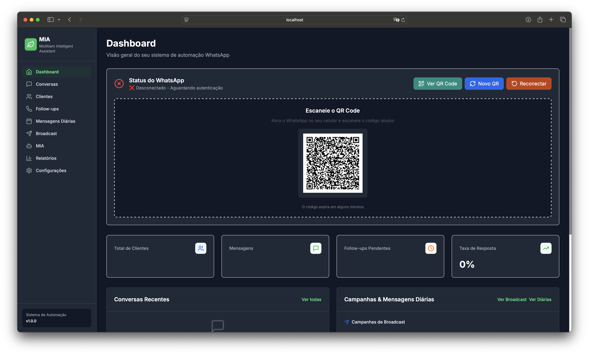
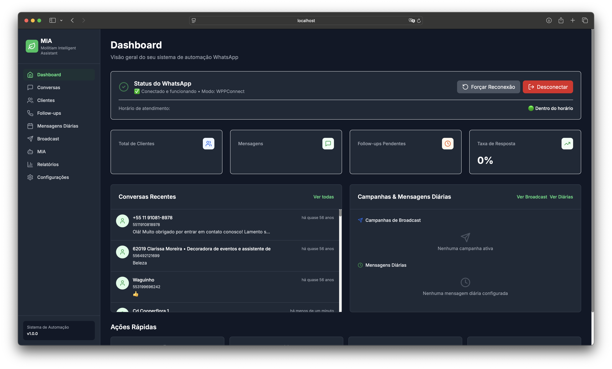

### Gestão de Conversas
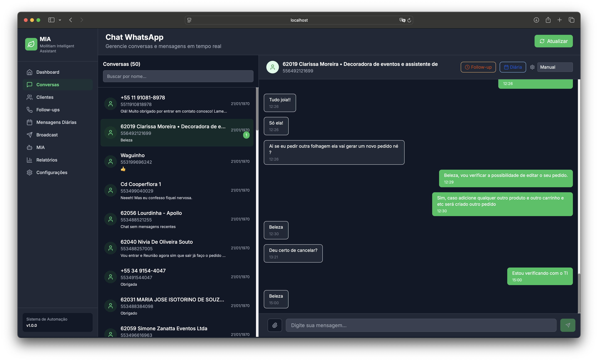

### Gestão de Clientes
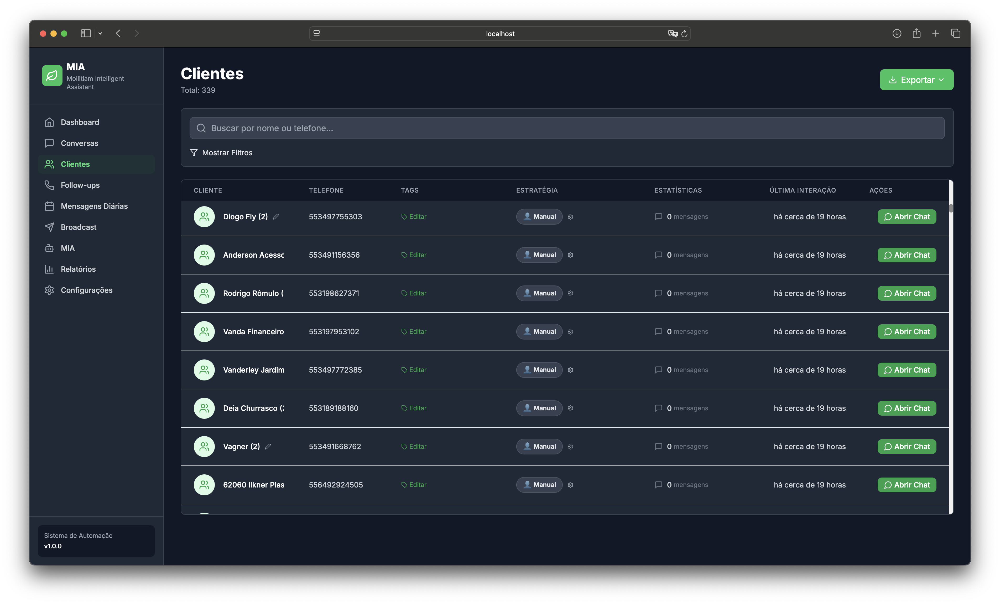

### Follow-ups Automáticos
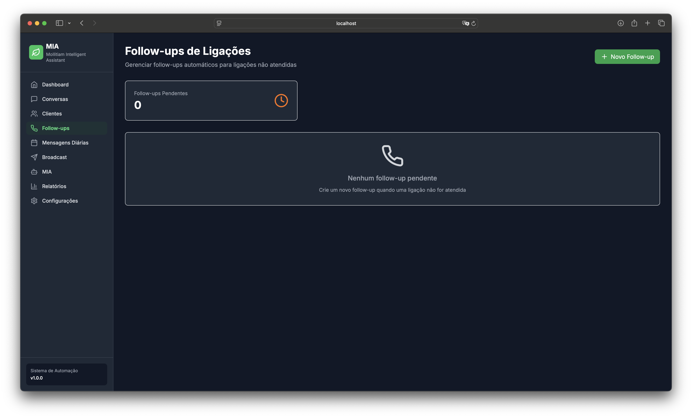
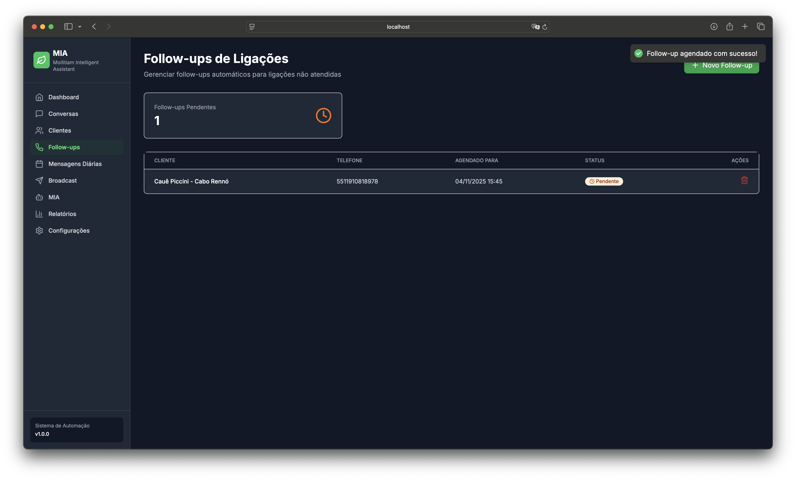

### Mensagens Diárias
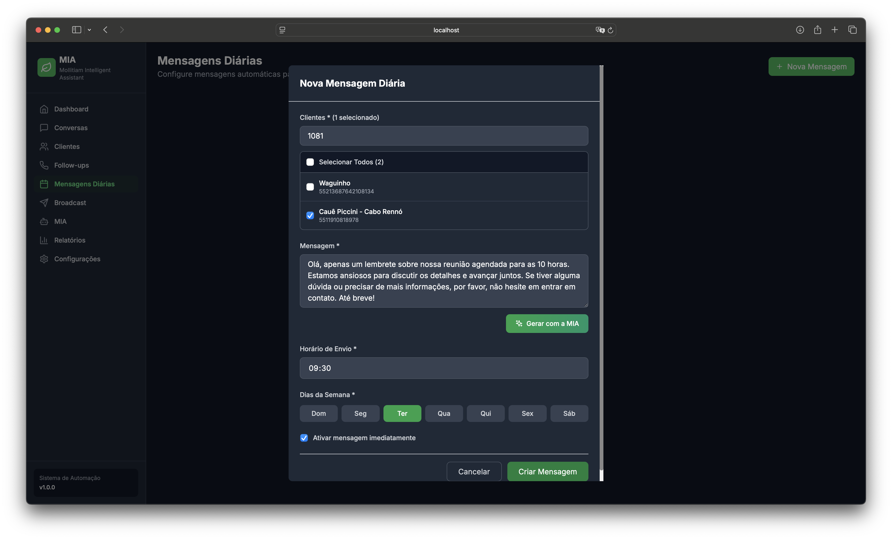
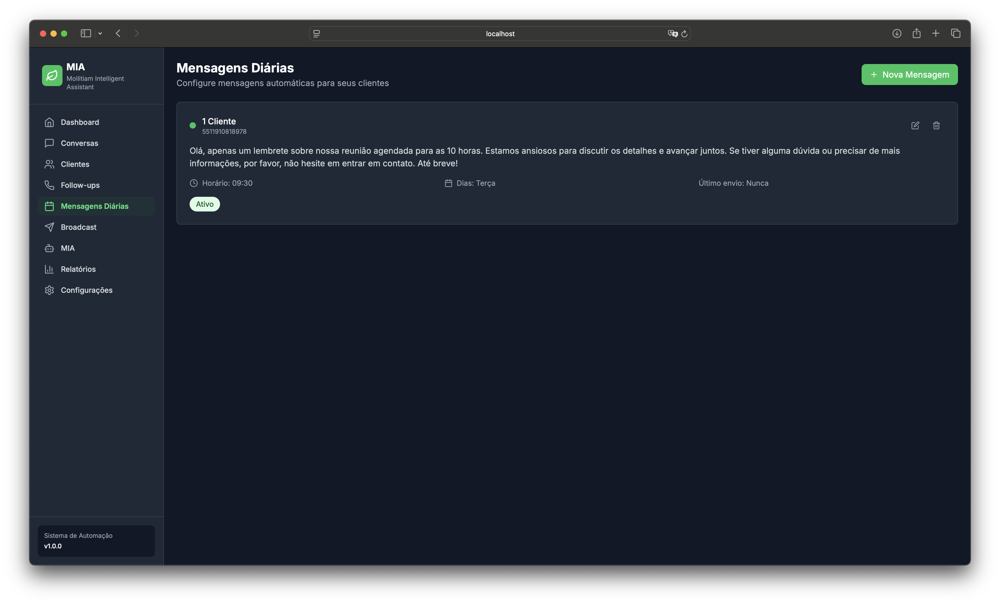

### Campanhas de Broadcast
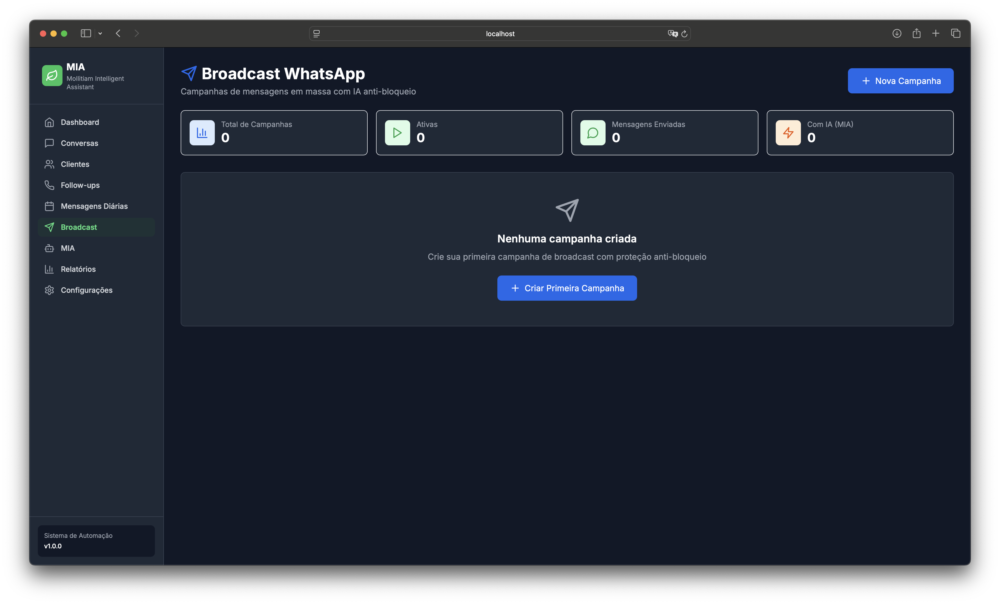
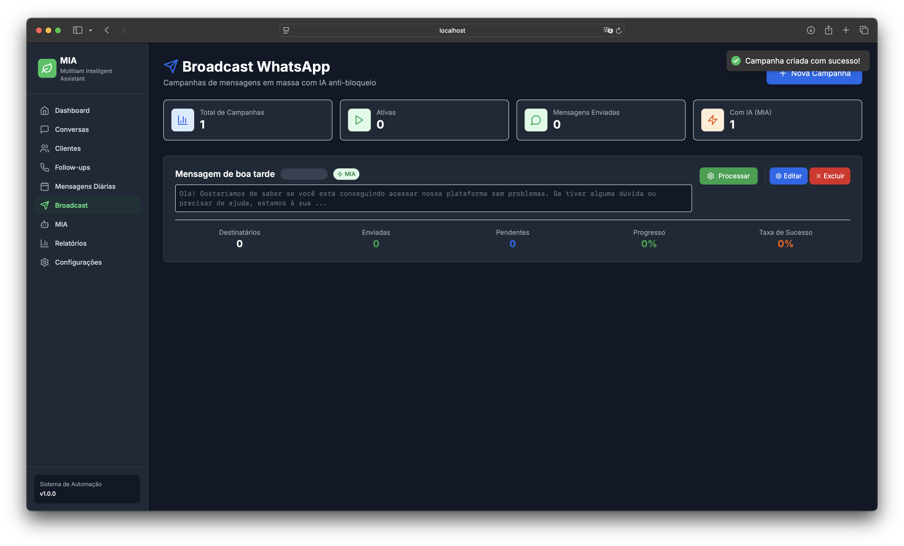

### Relatórios
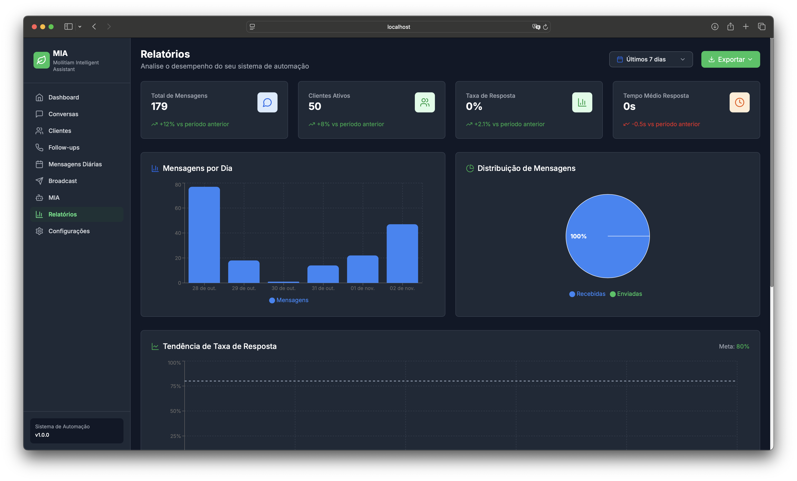

### Configurações
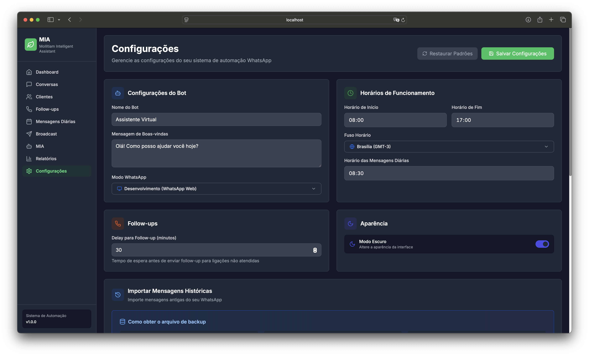
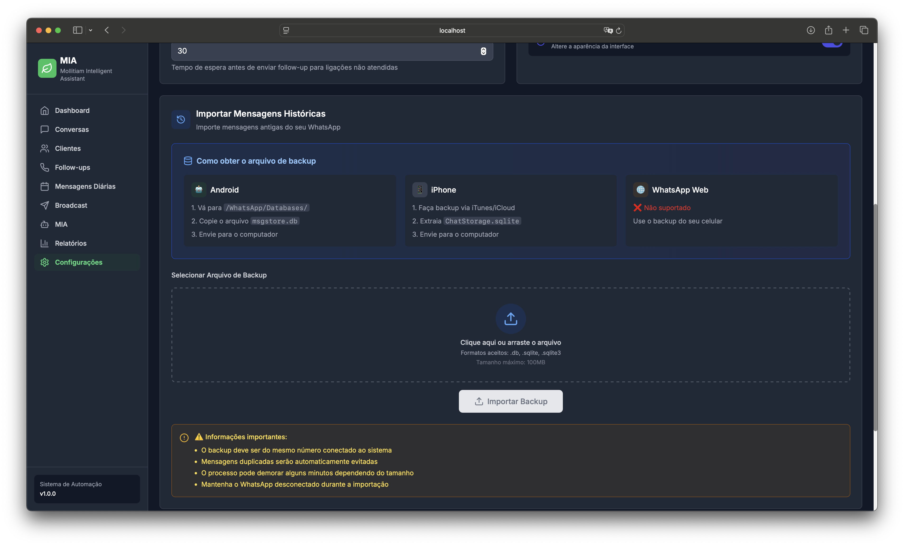

---

## 🛠️ Tecnologias Utilizadas

### Frontend
- **Next.js** - Framework React moderno
- **React** - Biblioteca para interfaces
- **TailwindCSS** - Estilização responsiva
- **TypeScript** - Tipagem estática

### Backend
- **Node.js** - Runtime JavaScript
- **Python** - Backend de IA e machine learning
- **TypeScript** - Desenvolvimento robusto

### Recursos Adicionais
- Integração com WhatsApp
- Inteligência Artificial conversacional
- Sistema de agendamento automático
- Exportação de relatórios
- Gráficos interativos

---

## 🎯 Casos de Uso

### Para Empresas
- Automação de atendimento ao cliente
- Campanhas de marketing segmentadas
- Follow-up de vendas automatizado
- Gestão centralizada de contatos
- Relatórios de performance

### Para Profissionais
- Organização de contatos e leads
- Agendamento de mensagens
- Histórico de conversas
- Lembretes automáticos
- Análise de engajamento

---

## 🔒 Segurança e Privacidade

- Autenticação segura
- Criptografia de dados
- Validação de inputs
- Logs de auditoria
- Backup automático

---

## 🚀 Inicialização Rápida

O sistema foi projetado para ser simples de iniciar:

1. **Configurar variáveis de ambiente**
2. **Instalar dependências**
3. **Conectar WhatsApp via QR Code**
4. **Acessar dashboard web**

> **Nota:** Este é um repositório demonstrativo. O código completo e instruções de instalação não estão disponíveis publicamente.

---

## 💡 Diferenciais

### MIA - Assistente Inteligente
Diferente de chatbots tradicionais, a MIA:
- Entende contexto e nuances da linguagem natural
- Aprende com cada interação
- Sugere ações proativas baseadas em padrões
- Executa tarefas complexas automaticamente
- Mantém memória de conversas anteriores

### Interface Intuitiva
- Design moderno e responsivo
- Experiência de usuário otimizada
- Gráficos e visualizações claras
- Navegação simples e eficiente

### Automação Avançada
- Follow-ups inteligentes
- Campanhas segmentadas
- Mensagens recorrentes programadas
- Monitoramento em tempo real

---

## 📊 Métricas e Analytics

O sistema oferece métricas detalhadas:
- Total de clientes e conversas ativas
- Mensagens enviadas e taxa de entrega
- Taxa de engajamento e resposta
- Performance de campanhas
- Alertas de problemas automáticos

---

## 🎓 Arquitetura

O sistema utiliza uma arquitetura moderna e escalável:
- **Frontend responsivo** para acesso web
- **Backend híbrido** para máxima performance
- **IA conversacional** para automação inteligente
- **Banco de dados robusto** para armazenamento seguro

---

## 📚 Documentação

Este projeto possui documentação completa incluindo:
- Guias de início rápido
- Documentação da API
- Tutoriais de uso
- Exemplos práticos
- Troubleshooting

> **Nota:** A documentação completa está disponível apenas no repositório privado.

---

## 🌟 Destaques

### Conversação Natural
Converse com a MIA como se estivesse falando com um assistente humano:
```
"Criar campanha para clientes VIP hoje às 18h"
"Quantos clientes ativos tenho?"
"Agendar follow-up para leads inativos"
```

### Automatização Inteligente
- ✅ Execução automática de tarefas seguras
- ✅ Confirmação apenas para ações críticas
- ✅ Validação e correção de parâmetros
- ✅ Sugestões proativas de otimização

### Aprendizado Contínuo
- ✅ Melhora com feedback do usuário
- ✅ Identifica padrões de sucesso
- ✅ Ajusta comportamento dinamicamente
- ✅ Sugestões cada vez mais precisas

---

## 🎯 Performance

- Interface rápida e responsiva
- Processamento em tempo real
- Escalável para alto volume
- Otimizado para performance

---

## 🔄 Integração WhatsApp

Conecte facilmente sua conta WhatsApp:
1. QR Code gerado automaticamente
2. Escaneie com WhatsApp no celular
3. Conexão estabelecida em segundos
4. Troque de conta quando necessário

---

## 📞 Contato

Para mais informações, entre em contato:  
**https://mollitiamdevelopment.great-site.net**

---

## 📄 Licença e Uso

**© Mollitiam Development**

🚫 **Este repositório é demonstrativo.** O uso, cópia, distribuição ou qualquer forma de reprodução sem autorização explícita é **estritamente proibido**.

Este projeto é apresentado exclusivamente para fins de demonstração de capacidades técnicas e portfólio profissional.

---

## ⚠️ Aviso Legal

- Este projeto é apenas para demonstração
- Não há suporte ou garantias fornecidas
- O código completo não está disponível publicamente
- Todos os direitos reservados

---

**WhatsApp Automation - Demonstração de Sistema Profissional de Automação**

*Desenvolvido por Mollitiam Development*
